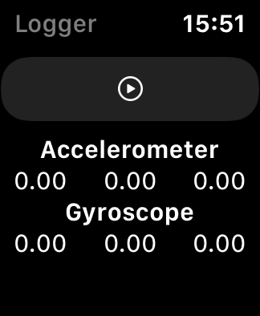

#  Logger Watch

This application can measure acceleration data, gyroscope data

[Logger](https://github.com/Shakshi3104/Logger5) for watchOS

## Version
0.1.0

## Requirements
- watchOS 6.2+
- Xcode 11.5+

## Update History

|Version|Update Date|Contents|
|:----:|:-------------:|:---------|
|0.0.0|2020/5/3| SwiftUI test|
|0.0.1|2020/5/3| Combine test|
|0.1.0|2020/5/3| Implement display acceleration data|

## Future
Independently developed [Logger for iOS](https://github.com/Shakshi3104/Logger5) and Logger for watchOS will be combined into a single app (Logger for iOS and watchOS).
